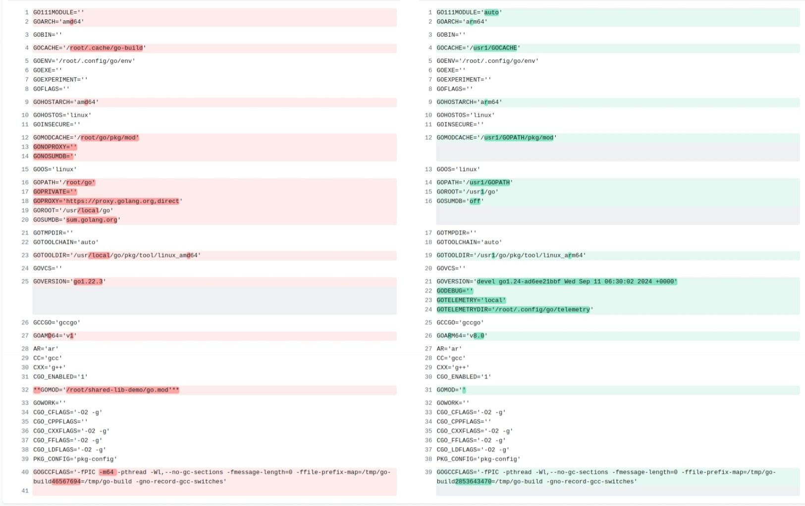

## Member
- ianlancetaylor
- [cmd/go: remove -buildmode=shared (not c-shared)](https://github.com/golang/go/issues/47788)
- rasky

## **Verify Your Project Structure**

```bash
mkdir -p  /root/shared-lib-demo/pkg/mathops
```

- The directory structure:
  ```
  /root/shared-lib-demo/
  ├── go.mod
  ├── pkg/
  │   └── mathops/
  │       └── mathops.go
  └── main.go
  ```


## Create the `pkg/mathops/mathops.go` file with the following content:

```go
// pkg/mathops/mathops.go
package mathops

func Add(a, b int) int {
    return a + b
}

func Subtract(a, b int) int {
    return a - b
}
```


## Create the `main.go` file in the root directory

```go
// main.go
package main

import (
    "fmt"
    "shared-lib-demo/pkg/mathops"
)

func main() {
    sum := mathops.Add(10, 5)
    diff := mathops.Subtract(10, 5)
    fmt.Println("Sum:", sum)
    fmt.Println("Difference:", diff)
}
```
```
# build shared std lib
%if %{shared}
GOROOT=$(pwd) PATH=$(pwd)/bin:$PATH go install -buildmode=shared -v -x std
%endif
```

```bash
cd /root/shared-lib-demo
go install -v -x -buildmode=shared std
```
## Otherwise Errors and Explaination:
- The error message:
```
cannot use packages shared-lib-demo/pkg/mathops and runtime/cgo from different roots and /usr/local/go/pkg/linux_amd64_dynlink
```
- The error occurs because Go cannot mix packages from different roots when building a shared library. To resolve this, either avoid using shared libraries or rebuild the standard library as a shared library. Shared libraries in Go are not commonly used, so carefully consider whether they are necessary for your use case.

- makeslice: cap out of range
- This error typically occurs when attempting to create a slice with a length greater than its capacity

## **Initialize the Go Module**
```bash
cd /root/shared-lib-demo
go mod init shared-lib-demo
```

     
## **Rebuild the Standard Library as a Shared Library**     
```bash
go install -x -buildmode=shared -linkshared ./pkg/mathops
```
---
     
## **Clean the Build Cache**:
   - Clear the Go build cache to ensure there are no corrupted artifacts:
     ```bash
     go clean -cache -modcache -i -r
     ```
$ go env
```
GO111MODULE=''
GOARCH='amd64'
GOBIN=''
GOCACHE='/root/.cache/go-build'
GOENV='/root/.config/go/env'
GOEXE=''
GOEXPERIMENT=''
GOFLAGS=''
GOHOSTARCH='amd64'
GOHOSTOS='linux'
GOINSECURE=''
GOMODCACHE='/root/go/pkg/mod'
GONOPROXY=''
GONOSUMDB=''
GOOS='linux'
GOPATH='/root/go'
GOPRIVATE=''
GOPROXY='https://proxy.golang.org,direct'
GOROOT='/usr/local/go'
GOSUMDB='sum.golang.org'
GOTMPDIR=''
GOTOOLCHAIN='auto'
GOTOOLDIR='/usr/local/go/pkg/tool/linux_amd64'
GOVCS=''
GOVERSION='go1.22.3'
GCCGO='gccgo'
GOAMD64='v1'
AR='ar'
CC='gcc'
CXX='g++'
CGO_ENABLED='1'
**GOMOD='/root/shared-lib-demo/go.mod'**
GOWORK=''
CGO_CFLAGS='-O2 -g'
CGO_CPPFLAGS=''
CGO_CXXFLAGS='-O2 -g'
CGO_FFLAGS='-O2 -g'
CGO_LDFLAGS='-O2 -g'
PKG_CONFIG='pkg-config'
GOGCCFLAGS='-fPIC -m64 -pthread -Wl,--no-gc-sections -fmessage-length=0 -ffile-prefix-map=/tmp/go-build46567694=/tmp/go-build -gno-record-gcc-switches'

```



```bash
go install -v -x -buildmode=shared std
```


```bash
go build -linkshared  main.go 
```

```
controlplane $ ls -ltr
-rwxr-xr-x 1 root root 19664 Jan  6 02:00 shared-lib-demo
-rwxr-xr-x 1 root root 19664 Jan  6 02:04 main
```

```
$ ldd  ./main
        linux-vdso.so.1 (0x00007ffcf9b9a000)
        libstd.so => /usr/local/go/pkg/linux_amd64_dynlink/libstd.so (0x00007fb83fd5b000)
        libc.so.6 => /lib/x86_64-linux-gnu/libc.so.6 (0x00007fb83fb59000)
        libdl.so.2 => /lib/x86_64-linux-gnu/libdl.so.2 (0x00007fb83fb53000)
        libpthread.so.0 => /lib/x86_64-linux-gnu/libpthread.so.0 (0x00007fb83fb30000)
        /lib64/ld-linux-x86-64.so.2 (0x00007fb842955000)
```
